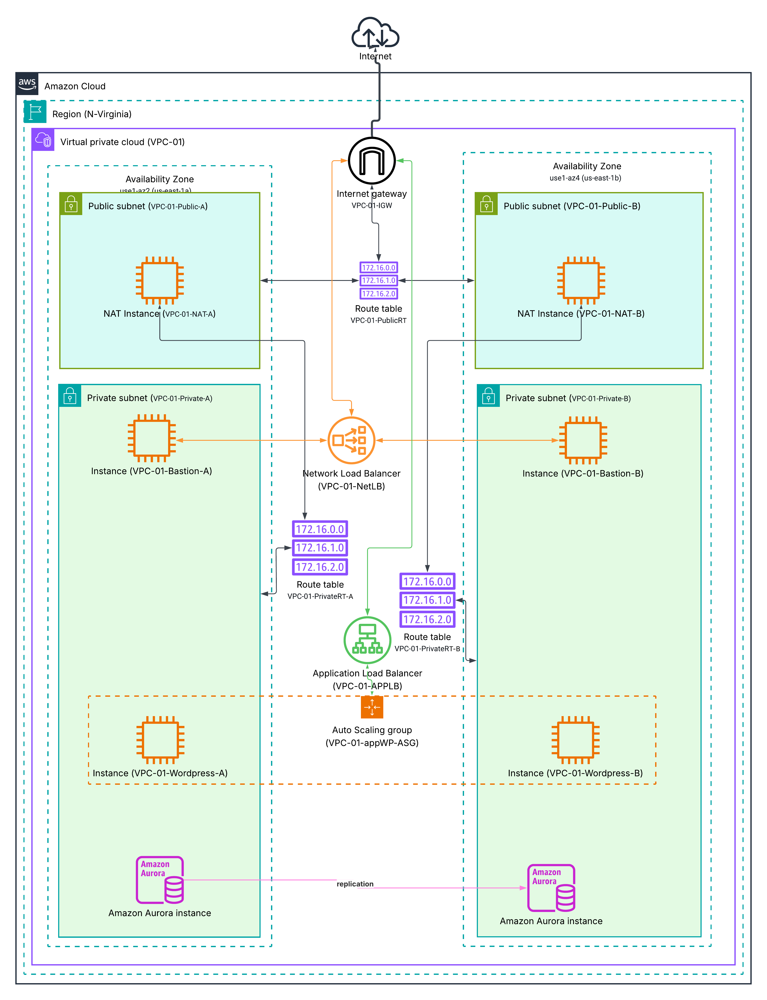

# Dokumentacja Architektury
Autor: Paweł Koc

## 1. Sieć
**Główny komponent:**
* Region: us-east-1 (N-Virginia)
* VPC Name: VPC-01
* VPC CIDR: 10.0.0.0 /16
* Internet Gateway: VPC-01-IGW (Attached to VPC-01)

**Podsieci (Subnets):**

| Nazwa Podsieci | Typ | Availability Zone | Adresacja |
|---|---|---|---|
| VPC-01-Public-A | Publiczna | us-east-1a (use1-az2) | 10.0.1.0/24 |
| VPC-01-Public-B | Publiczna | us-east-1b (use1-az4) | 10.0.2.0/24 |
| VPC-01-Private-A | Prywatna | us-east-1a (use1-az2) | 10.0.10.0/24 |
| VPC-01-Private-B | Prywatna | us-east-1b (use1-az4) | 10.0.11.0/24 |

## 2. Tabele Routingu
* **VPC-01-PublicRT** (Przypisana do: VPC-01-Public-A, VPC-01-Public-B)
  * 10.0.0.0/16 -> local
  * 0.0.0.0/0 -> igw-0f187f0623f3d4a48 <VPC-01-IGW>
* **VPC-01-PrivateRT-A** (Przypisana do: VPC-01-Private-A)
  * 10.0.0.0/16 -> local
  * 0.0.0.0/0 -> eni-0585655fe732a9738 <VPC-01-NAT-A>
* **VPC-01-PrivateRT-B** (Przypisana do: VPC-01-Private-B)
  * 10.0.0.0/16 -> local
  * 0.0.0.0/0 -> eni-09c9f188d13f400c3 <VPC-01-NAT-B>

## 3. Instancje
**Instancje Standalone:**
* **VPC-01-NAT-A:**
  * Lokalizacja: VPC-01-Public-A
  * Wymagania: Wyłączona opcja Source/Destination check, przypisany Elastic IP.
* **VPC-01-NAT-B:**
  * Lokalizacja: VPC-01-Public-B
  * Wymagania: Wyłączona opcja Source/Destination check, przypisany Elastic IP.
* **VPC-01-Bastion-A:**
  * Lokalizacja: VPC-01-Private-A
* **VPC-01-Bastion-B:**
  * Lokalizacja: VPC-01-Private-B

**Auto Scaling Group (ASG):**
* ASG Name: VPC-01-appWP-ASG
* VPC Subnets: VPC-01-Private-A, VPC-01-Private-B
* Zarządzane instancje: VPC-01-Wordpress-A, VPC-01-Wordpress-B

## 4. Równoważenie Obciążenia
* **VPC-01-NetLB (Network Load Balancer):**
  * Scheme: Internet-facing
  * Listener: TCP:22 (SSH)
  * Target Group: Typ Instance, przypisane targety: VPC-01-Bastion-A, VPC-01-Bastion-B
* **VPC-01-APPLB (Application Load Balancer):**
  * Scheme: Internet-facing
  * Listener 1: HTTP:80 (Akcja: Przekierowanie na HTTPS:443)
  * Listener 2: HTTPS:443 (Akcja: Forward do grupy docelowej, wymóg certyfikatu SSL/ACM)
  * Target Group: Typ Instance, protokół HTTP:80, zintegrowana z VPC-01-appWP-ASG

## 5. Baza Danych
**Amazon Aurora Cluster:**
* Typ wdrożenia: Multi-AZ (Primary + Replica)
* DB Subnet Group: VPC-01-Private-A oraz VPC-01-Private-B
* Instancja Primary: Strefa us-east-1a
* Instancja Replica (Async): Strefa us-east-1b

## 6. Bezpieczeństwo (security groups)
* **VPC-01-NetLB-SG**
  * Cel: obsługa ruchu administracyjnego
  * Przypisanie: VPC-01-NetLB
  * Inbound: Port 22 (TCP)
* **VPC-01-BastionSG**
  * Cel: Zabezpieczenie serwerów Bastion.
  * Przypisanie: VPC-01-Bastion-A, VPC-01-Bastion-B
  * Inbound: Port 22 (TCP) tylko dla VPC-01-NetLB-SG
* **NATSG-A oraz VPC-01-NATSG-B**
  * Cel: Obsługa ruchu wyjściowego z podsieci prywatnych w strefach A i B.
  * Przypisanie: VPC-01-NAT-A, VPC-01-NAT-B
  * Inbound: (All trafic)
* **VPC-01-ALBSG**
  * Cel: Przyjmowanie publicznego ruchu webowego.
  * Przypisanie: VPC-01-APPLB
  * Inbound: Port 80 (HTTP) oraz Port 443 (HTTPS) ze źródła 0.0.0.0/0
* **VPC-01-AppSG**
  * Cel: Zabezpieczenie maszyn aplikacyjnych w Auto Scaling Group.
  * Przypisanie: VPC-01-appWP-ASG
  * Inbound: Port 80 (HTTP) – wyłącznie ze VPC-01-ALBSG. Port 22 (SSH) ze źródła VPC-01-BastionSG.
* **VPC-01-DBSG**
  * Cel: Ochrona warstwy danych.
  * Przypisanie: Klastry i instancje Amazon Aurora.
  * Inbound: Port 3306 (MySQL/Aurora) – wyłącznie ze VPC-01-AppSG
